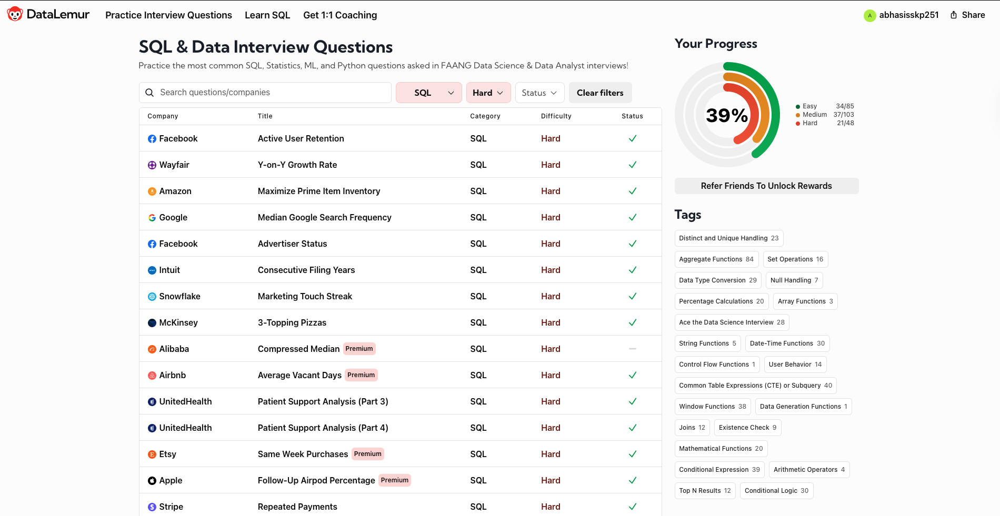

## 🧠 Abhay Singh — Data & AI Engineer  
📍 *Bloomington, Indiana, USA*  
🎓 *M.S. in Data Science @ Indiana University (GPA: 3.9)*  
📧 [abhaysaikap@gmail.com](mailto:abhaysaikap@gmail.com) • [LinkedIn](https://www.linkedin.com/in/asr251/) • [GitHub](https://github.com/AbhaySinghR) • [Portfolio](https://abhaysinghr.github.io/AbhayPortfolio/) 

---
### 🧮 Competitive Programming & SQL Practice

#### 💻 LeetCode Progress — Algorithmic Thinking
> https://leetcode.com/u/rana43338/

#### 📊 DataLemur Progress — SQL Challenges [Solved All]
> 

---

### 💼 Professional Experience
- **O’Neill School of Public and Environmental Affairs (Indiana University)** — Data & ML Engineer
- **A.P. Moller Maersk (Bangalore)** — ML Engineer
- **Microsoft (Contract via MAQ Software, Hyderabad)** — Data Engineer

---

